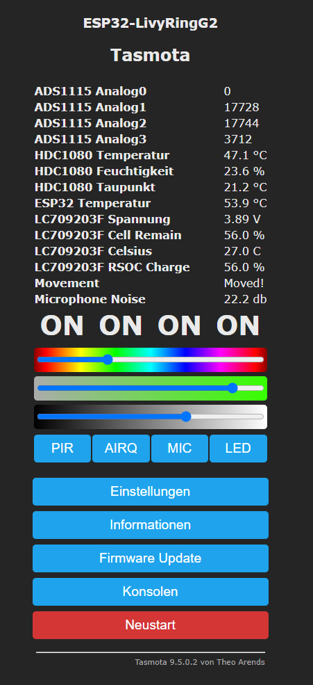

# Vorwort
 :warning: **Prüft bitte das PCB Layout [dieses](https://github.com/Schnup89/LIVY_RING_G2-Tasmota/issues/11) wird noch nicht unterstützt! Nach aktuellem Stand werden nur die LivyRinge mit 19 am Anfang der Seriennummer unterstützt**

 :warning: **Batteriebetrieb aktuell und in absehbarer Zeit nicht möglich**   
   
 :warning: **Es gibt keine Garantie das alle Sensoren in Tasmota implementiert werden können**  
 

Deskstand STL :link: [Erstellt von Trashwarez, vielen Dank!](https://github.com/Schnup89/LIVY_RING_G2-Tasmota/issues/8)     
Source-Code :clipboard:    https://github.com/Jason2866/LIVY_RING_G2-Tasmota  


Sobald ihr den ESP flashed, gibt es kein zurück auf den Ursprungszustand, außer Ihr sichert euch evtl. den Flash (habe ich weder gemacht noch getestet).
Ich übernehme keine Haftung für irgendwas ;)  
  
Bitte entfernt für die Tests die drei LiPo Batterien, achtet auf die korrekte Polung!


PIN-Layout ESP32-WROOM-32X
https://tasmota.github.io/docs/Pinouts/#esp32-wroom-32x

Ich versuche die custom libarys aufzuräumen und per git Push in tasmota zu integrieren.
Damit könnt ihr immer die neuste tasmota Version kompilieren.

## Was funktioniert?
- [Tasmota](https://github.com/arendst/Tasmota) und alle seinen Funktionen :)
- LED Steurung (Rot,Grün,Blau) [Sichtbar am PIR Sensor] 
- Der Reset-Knopf für beliebige Funktion
- Temperatur & Luftfeuchtigkeitssensor
- Piezo per PWM ansteuerbar
- Mikrofon-Lautstärkepegel auslesbar
- Bewegungssensor
- Gas-Sensor
- Auslesen des Spannungschips


## Was funktioniert nicht?
:construction_worker: Energiesparfunktionen <- werden evtl. nachgereicht  
:construction_worker: Gas-Sensor Anzeige in ppm <- Work in progress, da brauche ich Hilfe  
:construction_worker: Aus/Einschalten der AirQuality-Sensoren (bei der aktivierung werden diese nicht mehr im i2c bus erkannt)  
:x: RTC, der Zeitgeber um Uhrzeit auch ohne WLAN zu aktualisieren <- Wird von mir nicht umgesetzt 


## Den Ring öffnen
- Plastikschutzfolio an der Unterseite des "RING" entfernen
- Vier Kreuzschlitzschrauben entfernen (am besten die Löcher mit einem Schranubenzieher ertasten)
- Ring entfernen


## Update  
Wenn ihr einmal geflashed habt und das Webinterface von Tasmota erreichbar ist könnt ihr die Binary hier im Repo über das Webinterface -> Firmware Update hochladen.  
**Bei Problemen nach dem Update bitte "Konfiguration zurücksetzen"**  


## Flashen
!!!! Batterien entfernen !!!!

~~ Was ihr braucht ~~
- Einen USB TTL Adapter oder ein anderes Gerät mit TTL USB RX TX Schnittstelle
- Tasmota Binary livyringg2tasmo.bin aus diesem Repository
- Tasmota "Flash-Files" https://github.com/arendst/Tasmota-firmware/tree/main/release-firmware/tasmota32/ESP32_needed_files
- Flasher Linux https://github.com/espressif/esptool 
- oder Flasher Windows (Müsst ihr probieren, hier die originale Anleitung: https://tasmota.github.io/docs/ESP32/#flashing)

~~ Vorbereitung ~~  

livyringg2tasmo.bin und alle vier Flasfiles in den selben Ordner wie das Flash-Tool ablegen.
Ich habe für das Flashen die Kabel direkt an die Pins des ESP-Chip rangehalten, mit etwas Geduld hat es dann funktioniert ;)

~~ Flashen ~~  
- gpio0 mit GND verbinden (am einfachsten das Gehäuse des PushButton als GND nehmen)
- ESP32 starten (USB Kabel verbinden)
- Led bleibt dauerhaft "grün" <- Flashmodus aktiv
- gpio0 Verbindung zu GND trennen
- gpio1 mit dem TTL-Modul RX verbinden
- gpio3 mit dem TTL-Modul TX verbinden
- Kommando ausführen: 
```
esptool.py --chip esp32 --port COM4 --baud 921600 --before default_reset --after hard_reset write_flash -z --flash_mode dout --flash_freq 40m --flash_size detect 0x1000 bootloader_dout_40m.bin 0x8000 partitions.bin 0xe000 boot_app0.bin 0x10000 livyringg2tasmo.bin
```
- Wenn der Flasher erfolg vermeldet hat, den ESP neu starten und es sollte ein Tasmota WLAN für die weitere Einrichtung erscheinen.
- Im Webinterface unter "Einstellungen" -> "Gerät" -> "Gerätetyp" LivyRing auswählen und unten mit "speichern" bestätigen.


## Einstellungen Tasmota  
~~  Voreingestellt ~~  
[SetOption114](https://tasmota.github.io/docs/Commands/#setoption114)  -  eingeschaltet um Switches von Relays zu trennen    
  
 ~~ Konsolen-Kommandos  ~~  
Um den Buzzer zu aktivieren:  
```
setoption111 1
```   

Für die Beschriftung der Buttons in der UI:  
```
WEBBUTTON1 PIR  
WEBBUTTON2 AIRQ  
WEBBUTTON3 MIC  
WEBBUTTON4 LED 
``` 

Konfiguration Bewegungsmelder:  
```
Sensor90 sens, 30
Sensor90 blind, 2
Sensor90 pulse, 1
```   

Konfiguration persistent für Bewegungsmelder:   _(Rule-Nummer nach Bedarf ändern)_
```
Rule1 ON System#Boot DO Backlog Sensor90 sens, 30; Sensor90 blind_time, 2; Sensor90 pulse, 1 ENDON
Rule1 1
oder für einen einzelnen Parameter:
Rule1 ON System#Boot DO Sensor90 sens, 30 ENDON
Rule1 1
```   

Konfiguration Spannungssensor Alarm-Pin-Schwellwert. Default 20%. 0 = Alarm deaktiviert  _(Rule-Nummer nach Bedarf ändern)_
```
Rule2 ON System#Boot DO Sensor89 perc, 15 ENDON
Rule2 1
```   





## gpios and sensor

~~ :heavy_check_mark: Buttons ~~  
gpio35  -  RESET  
 
~~ :heavy_check_mark: Motion (PIR) PYQ 1548/7660 ~~   
gpio32  -  serial IN       OUTPUT  
gpio2   -  DirectLink      INPUT  
gpio27  -  Power 3,3v Sensor ON/OFF   **[RELAY 1]**  
ToDo  -  Neue xsns Lib überarbeiten, evtl. GIT Push  

~~ :heavy_check_mark: LED ~~   **[RELAY 4]**  
gpio21  -  RED LED Inverted  
gpio22  -  BLUE LED Inverted  
gpio4   -  GREEN LED Inverted  

~~ :heavy_check_mark: PIEZO ~~   
gpio16  -  Funktioniert als PWM Output 
Bemerkung  -  Wird immer als letztes Relay angezeigt/hinzugefügt... warum auch immer :)  

~~ :heavy_check_mark: Mikrofon I2S PDM pk0641ht4h ~~   
gpio17  -  Clock (I2S In SLCT)  
gpio5  -  Data  (I2S In Data)  
gpio13  -  Power 3,3v Microphone ON/OFF   **[RELAY 3]**   
gpio15  -  Clock over DS1099 IC (Muss low sein)    

~~ :heavy_check_mark: GAS SENSOR CCS801 ~~  
Sensor  -  TLA2024 (?ADS1115?)  
gpio33  -  Power 3,3v Sensor ON/OFF   **[RELAY 2]**  
i2c  -  Heater über MCP4706  
ToDo  -  Rückgabewert in ppm umwandeln 

~~ :heavy_check_mark: HDC1080 Temperatur und Luftfeuchtigkeit ~~   
i2c  -  Gruppe1  
gpio33  -  Power 3,3v Sensor ON/OFF   **[RELAY 2]**  
  
~~ :heavy_check_mark: LiPO Spannungsanzeige [LC709203F] ~~  
i2c  -  Gruppe2  
gpio23 -  low power alarm  
low power alarm gpio finden und testen 

~~ :x: RTC Clock (MCP7940M)  
i2c  -  Gruppe2  
Komplizierte RTC, hier ist es der Aufwand nicht Wert, mit Tasmota haben wir NTP.  

~~ :heavy_check_mark: i2c GRUPPE 2 ~~  
gpio14  -  SDA    
gpio12  -  SCL   
Found Devices:  
{"I2CScan":"Device(s) found at 0x0b 0x6f"}  
0x0b = LC709203F (LiPo-SPannungsanzeige)  
0x6f = MCP7940M (RTC Clock)

~~ :heavy_check_mark: i2c GRUPPE 1 ~~   
gpio19  -  SDA  
gpio18  -  SCL   
Found Devices:  
{"I2CScan":"Device(s) found at 0x40 0x48 0x60"}  
0x40 = HDC1080 Temp&Feuchtigkeit  
0x48 = TLA2024 (?ADS1115?) Analog zu DigitalWandler  
0x60 = MCP4706(A0T-E/MA) ->(INA) MCP602 (OUTA)-> Heater für Gas Sensor  

